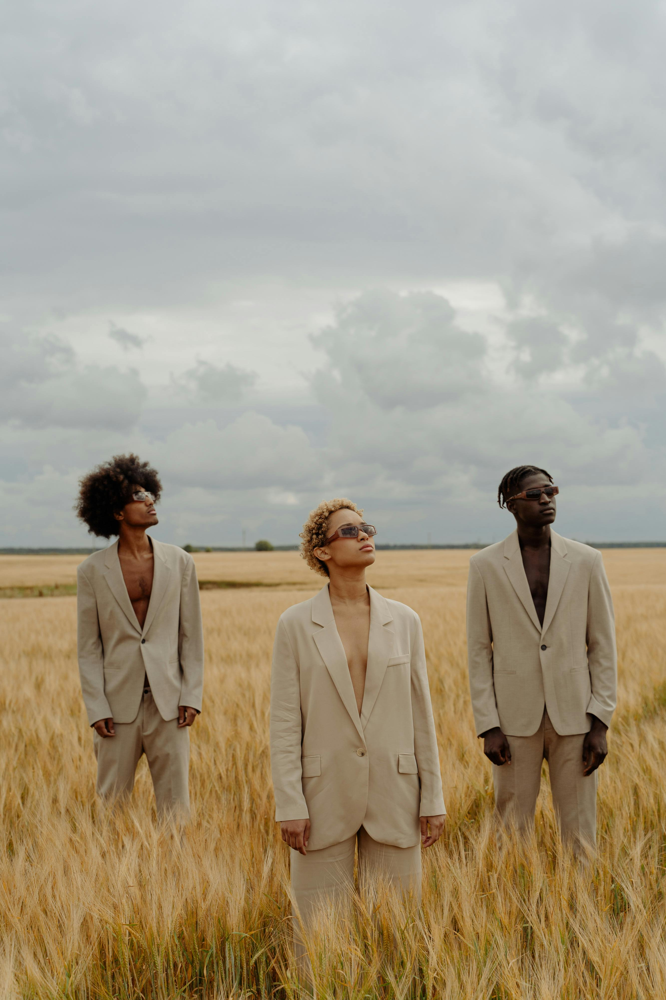

# ECOMMERCE WEBSITE
- It allows you to sell and buy physical goods, services and digital products over the internet.

# What will the ecommerce website focus on:
- Clothing
- Electronic devices
- Photography
- IT services

# 6 Best web designs i could find for inspiration

1. hopaal.com
2. elder-statesman.com
3. kith.com
4. kyliecosmetics.com
5. petalandpup.com
6. thisisaday.com

# The brand name of our ecommerce clothing site

1. dripfuel.com
2. chiclogic.com
3. vanityengine.com
4. luxuriana.com
5. goldentthread.com
6. exquisito.com
7. radiant.com

# Questions 

1. Can we create an ecommerce website of an existing brand?

# Requirement 

1. Microsoft access for the database.
2. Functioning cart system
3. Customers must be able to checkout.
4. Functioning billing sytem.
5. Full Report about the project:
  - About the project.
  - The products sold
  - The softwares used.
  - Screenshot of the website.
6. Group name must be on the cover page of the report, then on the second page  it must be the table of contents, 3rd page must have group members list must be there . make sure you show next to the names which task did each member do on the project. NO FREE RIDES
# Extra code 
<section class="image-fullers">
        
        
        
    </section>

